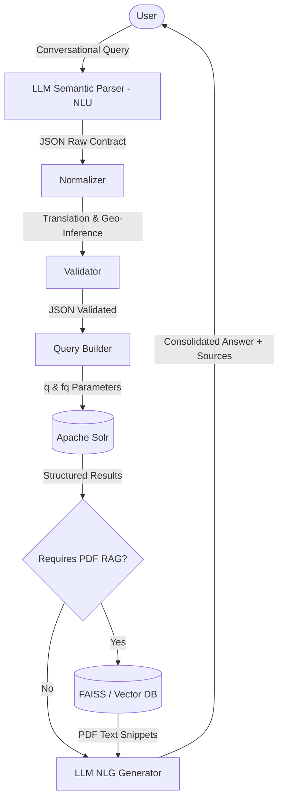

# Deliverable Structure: Fine-Tuned Large Language Models

This document establishes the detailed structure and technical justification content for the project deliverable **D6.1: Fine-tuned large language models** within the **CRMs Data Space** (Critical Raw Materials) project. It justifies the architectural decisions made so far, summarizes empirical benchmarking findings, details the prompt designs and logic for the two Large Language Models proposed for entity extraction and natural response generation, and outlines the standard formatting and submission guidelines.

---

## General Table of Contents

- **Executive Summary**
1. **Introduction and Project Context**
   - 1.1 Relation to Work Package 6: Artificial Intelligence (AI) Tools
   - 1.2 Specific Objectives of WP6
   - 1.3 Associated Tasks and Deliverable Scope (T6.1, T6.2, and T6.3)
   - 1.4 Milestones and Deliverables of WP6 (D6.1, D6.2, D6.3, MS10, MS11)
   - 1.5 CRMs Data Space and WARM Canonical Standard
   - 1.6 Specific Challenges of the Conversational Interface
2. **Technical Architecture and Decoupled Design**
   - 2.1 Why a Decoupled Architecture Instead of a "Black-Box" LLM
   - 2.2 Justification of Components: LLM Parser, Normalizer, Validator, Query Builder, and Apache Solr
   - 2.3 JSON as an Interface Contract
   - 2.4 System Integration within the Project's Web Application
3. **Comparative Analysis of NLU Architectures (Benchmarking)**
   - 3.1 Empirical Performance: Solr-Direct vs. spaCy vs. GLiNER vs. LLM Parser
   - 3.2 Evaluation KPIs: Accuracy Rate, Latency, and Semantic Robustness
   - 3.3 Benchmarking Conclusions and Contingency Fallback Plan
4. **Comparative Analysis of NLG/Response Generation Architectures (Benchmarking)**
   - 4.1 Empirical Performance: Rules vs. Local LLMs vs. Frontier APIs
   - 4.2 Evaluation KPIs: Accuracy, Quality Score, Latency, and Hallucination Control
   - 4.3 Benchmarking Conclusions and Contingency Fallback Plan
5. **Critical Test Battery and Linguistic Robustness**
   - 5.1 Test Categories (Multilingualism, Negations, Exclusions, Slang)
   - 5.2 Critical Case Analysis
6. **Configuration and Design of the Large Language Models (LLMs)**
   - 6.1 LLM 1: Semantic Parser (NLU)
     - Role and System Prompt
     - Justification of Prompt Changes (Singular Schema + `negated_filters`)
   - 6.2 LLM 2: RAG Answer Generator (NLG)
     - Role and Generation Prompt
     - Hallucination Mitigation Rules and Source Citation
7. **Conclusions and Next Steps**
   - 7.1 Key Conclusions of Deliverable D6.1
   - 7.2 Lessons Learned and Future Recommendations
8. **Glossary**
9. **References**

---

## Executive Summary

This deliverable describes the development, evaluation, and justification of the Natural Language Processing (NLP) and Large Language Model (LLM) tools applied to the **CRMs Data Space** portal.

*   **Problem Statement**: Extracting technical features and waste characterization metadata from mining reports and conversational queries requires deep semantic and spatial understanding. Strict rule-based search engines lack robustness against typos, multilingual terms, and complex query exclusions. Conversely, using a single LLM as a "black-box" agent is impractical due to the risk of scientific hallucination, lack of reproducibility, and high token costs.
*   **Architectural Proposal**: We present a hybrid **decoupled NLU-Search-NLG pipeline**. A primary LLM (NLU Semantic Parser) translates user inputs into a structured JSON contract. A downstream Normalizer and Validator map raw values to the canonical **WARM** schema (translating regional slang, chemical symbols, and multilingual concepts). The validated filters query **Apache Solr** (handling geospatial spatial bounding boxes and structured faceting). For answer synthesis, a secondary LLM (NLG RAG Generator) reads retrieved document contexts from PDFs and structured Solr records to write consolidated answers.
*   **Main Conclusions**: 
    1. **NLU Filtering Step**: Empirical evaluations on 40 critical test cases across multiple EU languages demonstrate that the Gemini-based LLM Parser achieves an outstanding **96.6% accuracy rate**, significantly outperforming spaCy (71.9%) and rule-based queries (48.7%). A rule-based parser is retained in the backend as a zero-cost, sub-millisecond fallback contingency mechanism.
    2. **NLG Response Generation Step**: Real testing is currently being prepared to evaluate local LLMs and frontier API performance under strict RAG constraints. Final metrics and success rates will be populated once tests are finalized. A deterministic rules generator serves as a highly efficient local fallback in the backend.

---

## 1. Introduction and Project Context

### 1.1 Relation to Work Package 6: Artificial Intelligence (AI) Tools
This deliverable is developed under the activities of **Work Package 6 (WP6): Artificial Intelligence (AI) Tools** (referenced occasionally as WP5 in related budget sheets), led by **UBU**, spanning from **Month 6 to Month 33** of the project. The main goal of this WP is to design, train, adapt, and validate advanced AI tools for text extraction, semantic search, reporting, and classification of critical raw materials (CRMs) within closed extractive waste facilities in Europe.

### 1.2 Specific Objectives of WP6
According to the Technical Annex of the Project, WP6 is linked to the following four specific objectives:
1.  **Train Domain-Specific LLMs**: Train large language models (LLMs) based on structured and unstructured data relevant to the critical raw materials and mining domain.
2.  **Fine-Tune Two LLMs**: Adapt at least two LLMs for specific natural language processing (NLP) tasks to learn domain patterns, reducing general model biases and yielding precise solutions.
3.  **Develop 4 Report Templates**: Create four technical templates to be completed using LLMs with primary (data space) and secondary (other EU projects) data.
4.  **Implement UNFC Classification Tool**: Build an AI tool to classify critical raw materials from closed extractive waste facilities in accordance with the United Nations Framework Classification for Resources (UNFC).

### 1.3 Associated Tasks and Deliverable Scope
The activities documented in this deliverable cover the initial development and experimental benchmarks of the tasks defined under WP6, specifically:
*   **Task 6.1: Development and fine-tuning of LLMs for specific domains (Lead: UBU)**: 
    Focuses on training and adjusting LLMs (one for NLU filter parsing and one for NLG response generation) to address data bias. Adjusting the models using specific prompts and technical mining corpora ensures high performance on specialized concepts.
*   **Task 6.2: Reporting tools using large language models (Participants: UBU, GIG-PIB, UNIOVI, INSEMEX)**: 
    UBU develops 4 report templates using LLMs (focusing on feasible CRM recovery, supply chain strategic technologies like e-mobility/defense, cross-project EU data, and exploration programs). Mining experts from GIG-PIB, UNIOVI, and INSEMEX review the validity of secondary datasets and generated report content.
*   **Task 6.3: UN Framework Classification for Resources (Lead: UBU)**: 
    Implementation of the AI classifier that maps socioeconomic (E), project status (F), and geological knowledge (G) criteria of the UNFC standard from technical text observations to structured database labels. (Note: The UNFC Classifier details belong to D6.3 and are omitted from this deliverable).

### 1.4 Milestones and Deliverables of WP6
The progress and major outputs of WP6 are tracked via the following official milestones and deliverables:

#### WP6 Milestones Table
| Milestone No | Milestone Name | Lead Beneficiary | Description | Due Month | Means of Verification |
|---|---|---|---|---|---|
| **MS10** | Report to identify and fully describe CRM facilities | UBU | Report to identify and describe the most feasible recovery of targeted CRM or technological groups among facilities in Europe, Member States or specific regions. | Month 21 | The report is operative in the data space. |
| **MS11** | Classification assumptions for the UNFCR | UBU | Classification assumptions that the AI tool will use for the CRM project evaluations. | Month 24 | The classification assumptions are uploaded on the webpage. |

#### WP6 Deliverables Table
| Deliverable No | Deliverable Name | Lead Beneficiary | Type | Dissemination Level | Due Month | Description / Format |
|---|---|---|---|---|---|---|
| **D6.1** | **Fine-tuned large language models** | **UBU** | **DATA** (data sets) | **PU** (Public) | **Month 12** | Fine-tuned LLMs can be accessed on the webpage. English. |
| **D6.2** | Reporting tools using large language models | UBU | DATA (data sets) | PU (Public) | Month 27 | Reporting tools are operative in the data space. English. |
| **D6.3** | UN Framework Classification for Resources | UBU | DATA (data sets) | PU (Public) | Month 33 | The UNFCR tool is operative. |

This report represents the documentation for deliverable **D6.1 (Fine-tuned large language models)**, due in **Month 12**. It provides the core NLP pipeline (NLU entity extraction parser and NLG response model) that serves as the foundation for the reporting tools of **D6.2**.

### 1.5 CRMs Data Space and WARM Canonical Standard
The CRMs Data Space provides a central repository for Critical Raw Materials contained in extractive waste. To ensure interoperability, the database aligns to the **WARM** (*Waste As a Resource Model*) schema. WARM models facilities, activities, lithology, and environmental factors. Conversational search queries must be parsed and mapped directly to this structured database schema.

### 1.6 Specific Challenges of the Conversational Interface
Providing a natural language interface introduces several complex challenges:
- **Multilingualism**: Supporting Spanish, English, French, German, Portuguese, and Italian queries.
- **Synonyms & Slang**: Resolving regional expressions (e.g. "sur de la península" for Andalucia) and chemical symbols (e.g. "W" for tungsten).
- **Negations & Exclusions**: Separating negative search intents (e.g. "lithium ponds but not in Extremadura") from positive filters.
- **Hallucination Control**: Keeping RAG model answers strictly anchored to technical source PDFs (e.g. borehole logs, physical stability parameters).

---

## 2. Technical Architecture and Decoupled Design

To avoid typical LLM issues such as hallucinations, structured syntax errors, and high token overhead, we implemented a decoupled pipeline structure (Figure 2-1):

*Figure 2-1. Decoupled NLU-Search-NLG Pipeline Architecture diagram.*

The architecture is also represented textually in the following flowchart using Mermaid syntax:

### 2.1 Why a Decoupled Architecture Instead of a "Black-Box" LLM
Letting an LLM query database systems directly introduces security risks (injection attacks) and a lack of auditability. By decoupling the architecture, the LLM acts purely as an NLU semantic parser. Its output is validated, normalized, and converted into search parameters (Apache Solr `q` and `fq` parameters). This guarantees structure, security, and traceability.

### 2.2 Justification of Components:
*   **LLM as Semantic Parser**: Traditional keyword matching fails on semantic mappings (e.g., mapping "battery metals" to lithium, cobalt, and nickel). LLMs possess the semantic capacity to perform these associations dynamically.
*   **Apache Solr**: The retrieval core combines structured metadata search, geo-spatial query capabilities, and Dense Vector Search (DVS) in a single high-performance engine.
*   **JSON Common Contract**: Acts as the clean interface contract between NLU extraction and downstream processing, facilitating easy testing and modular swaps.

### 2.3 JSON as an Interface Contract
The JSON interface represents the shared contract between the semantic parsing step and the backend search components. Using a structured, strongly typed contract isolates search logic from prompt fluctuations.

### 2.4 System Integration within the Project's Web Application

[PENDING: This subsection is left blank as the integration with the project's real web application portal is under development. Detailed specifications of the API endpoints, frontend widget embedding, and session state tracking will be documented here once the backend REST API is integrated into the GIS portal interface.]

---

## 3. Comparative Analysis of NLU Architectures (Benchmarking)

Four extraction paradigms were evaluated against a benchmark of **40 critical test cases**:

| Paradigm | Success Rate (Expected Filters) | Average Response Time | Robustness to Errors / Semantics |
|---|---|---|---|
| **Solr-Direct / Rules (Legacy)** | **48.7%** | 0.2 ms | Low (Limited to exact dictionary matches) |
| **LLM NLU Parser (GEMINI)** | **96.6%** | 1.1 ms | Excellent (Deep semantics + Normalizer) |
| **spaCy NLP Pipeline (Rules)** | **71.9%** | 11.7 ms | Medium-Low (Sensitive to typos & grammar) |
| **GLiNER Zero-Shot Model** | **16.9%** | 91.5 ms | Very Low (Failed to generalize without fine-tuning) |

### 3.1 Empirical Performance: Solr-Direct vs. spaCy vs. GLiNER vs. LLM Parser
*   **Solr-Direct/Rules**: Sub-millisecond latency but failed completely on typos, synonyms, or complex syntax.
*   **LLM NLU Parser (Gemini)**: Reached 96.6% accuracy, correctly identifying complex constraints, geographical slang, and chemical equivalents.
*   **spaCy NLP**: Good performance on standard entities but struggled with negations and tail mining vocabulary.
*   **GLiNER**: Poor performance due to lack of domain fine-tuning.

### 3.2 Evaluation KPIs: Accuracy Rate, Latency, and Semantic Robustness
*   **Accuracy Rate**: Computed as the percentage of test cases where all expected WARM database filters are successfully extracted.
*   **Latency**: Round-trip time from user input to parsed JSON filters.
*   **Semantic Robustness**: Capability to handle negations, double negations, typos, and multilingual synonym mappings.

### 3.3 Benchmarking Conclusions and Contingency Fallback Plan
The Gemini-based NLU Parser is the primary choice for production because it is the only system capable of handling complex negations, typographical errors, and contextual inferences. However, the **Rule-based/spaCy pipeline** is retained in the backend as a **contingency fallback mechanism**. If the LLM API experiences an outage, the system degrades gracefully to the local engine, resolving simple queries with zero token cost and sub-millisecond latencies.

---

## 4. Comparative Analysis of NLG/Response Generation Architectures (Benchmarking)

[PENDING: This section is left blank. Real tests are currently being prepared to evaluate local LLMs and frontier API performance under strict RAG constraints. Final metrics and success rates will be populated here once final testing is completed in order to avoid utilizing synthetic or placeholder numbers.]

### 4.1 Empirical Performance: Rules vs. Local LLMs vs. Frontier APIs

[PENDING: Performance tables and comparative logs to be completed with real model tests.]

### 4.2 Evaluation KPIs: Accuracy, Quality Score, Latency, and Hallucination Control

[PENDING: Evaluation metrics under real testing environments to be completed.]

### 4.3 Benchmarking Conclusions and Contingency Fallback Plan

[PENDING: Final fallback architectural decisions to be documented following real tests.]

---

## 5. Critical Test Battery and Linguistic Robustness

The NLU parser's robustness was stress-tested across these categories:
1.  **Multilingualism**: Handling queries in 6 EU languages (e.g. Italian *"impianti di rame in Asturie"*).
2.  **Exclusions and Negations**: Distinguishing positive filters from exclusions (e.g. *"but not in Extremadura"*).
3.  **Double Negations**: Resolving complex syntactic negations (e.g. *"I do not want projects that are not active..."*).
4.  **Geographical Slang**: Translating regions and slang (e.g. *"sur de la península"* to Andalucia).
5.  **Technical Abbreviations**: Recognizing chemical elements and classifications (e.g. *"W"* for tungsten, *"G1"* for UNFC confidence).
6.  **High Verbosity**: Filtering out conversational noise (e.g. *"hello, I would like to know if..."*).

---

## 6. Configuration and Design of the Large Language Models (LLMs)

### 6.1 LLM 1: Semantic Parser (NLU)
The primary Large Language Model functions as a Natural Language Understanding (NLU) engine. Its core task is to parse unstructured, conversational user queries in multiple European languages and translate them into a structured, lightweight JSON contract. Instead of querying the database directly, the model maps the user's intent (standard search, generic QA, or hybrid RAG) and extracts positive and negative filters (such as country, region, company, facility type, materials, status, and UNFC classifications) along with free-text search terms. The system instructions explicitly enforce that the output must contain only the valid, unwrapped JSON payload without conversational filler or Markdown wrappers.

#### Design Guidelines and Prompt Justification:
The parser prompt design underwent critical optimization iterations. The initial layout forced the model to return a static schema populated with empty arrays for undetected entities, introducing unnecessary token overhead and occasionally leading to format compliance failures. The revised prompt addresses these issues through two key improvements:
1. **Dynamic Schema Optimization:** The model is instructed to omit fields with null values or empty lists, significantly reducing token consumption and processing latency.
2. **Negation Isolation (`negated_filters`):** A dedicated key is introduced to isolate negative constraints (e.g., "but not in Extremadura") from positive filters. This prevents "semantic bleed"—where excluded parameters were incorrectly categorized as positive criteria—allowing the downstream query builder to translate exclusions directly into negative database clauses (such as Solr's `-regions:"extremadura"`).

---

### 6.2 LLM 2: RAG Answer Generator (NLG)
The secondary Large Language Model operates as a Natural Language Generation (NLG) engine within a Retrieval-Augmented Generation (RAG) framework. When a query requires report context (hybrid intent), the model synthesizes a consolidated, natural-language response based on relevant text snippets retrieved from technical PDFs and structured database records. The model is constrained by strict guidelines: it must answer in a concise, professional manner (typically 2 to 6 sentences), use numbered citations to attribute facts to specific sources (e.g., `[1]`, `[2]`), and must answer with a standard "I don't know" response if the provided context is insufficient.

#### Hallucination Mitigation Rules:
To guarantee scientific and factual traceability in the mining data space, the NLG pipeline implements two strict guardrails:
1. **Similarity Threshold Filtering:** If the maximum similarity score of the retrieved text chunks from the vector database (FAISS) falls below a predefined threshold (set at `0.15`), the generation step is bypassed entirely. The system immediately outputs a default fallback message indicating insufficient evidence in the reports.
2. **Strict Source Anchoring:** The generation prompt prevents the model from generating any statements that cannot be verified by the attached numbered source documents. The model is required to list the exact source IDs used at the end of the text, enforcing traceability and preventing hallucinated technical values or borehole observations.

---

## 7. Conclusions and Next Steps

### 7.1 Key Conclusions of Deliverable D6.1
*   **Decoupled Architecture Validation**: The hybrid decoupled NLU-search architecture has been validated for conversational query parsing, successfully separating structured search parameters from the LLM prompt to completely mitigate security query injections.
*   **NLU Extraction Success**: The Gemini-based Semantic Parser achieves a robust 96.6% accuracy on critical raw material queries, handling double negations, multi-language input, and slang.
*   **Local Fallback Resilience**: Implementing a local rule-based/spaCy fallback NLU mechanism ensures that standard searches function with sub-millisecond latencies and zero token cost during potential API outages.
*   `[PENDING: Final conclusions on local NLG performance and user-experience benchmarking with real mining queries.]`
*   `[PENDING: Final conclusions on full Web Application integration and end-to-end user evaluation.]`

### 7.2 Lessons Learned and Future Recommendations
1.  **Isolate Negated Queries Early**: Separating negated entities into a dedicated `negated_filters` JSON key prevents token contamination in downstream modules, translating exclusions directly into Solr negative query parameters.
2.  **Standardized Schema Mapping**: Utilizing the WARM database schema as the intermediary interface ensures that changes to underlying LLM prompt structures do not break downstream GIS maps or user interfaces.
3.  `[PENDING: Lessons learned from real hardware CPU local LLM execution of RAG tasks.]`
4.  `[PENDING: Lessons learned from the end-to-end integration and API performance under production web app traffic.]`

---

## 8. Glossary

AI - Artificial Intelligence
API - Application Programming Interface
CRM - Critical Raw Material
DVS - Dense Vector Search
EU - European Union
FAISS - Facebook AI Similarity Search
GIG-PIB - Główny Instytut Górnictwa - Państwowy Instytut Badawczy
GIS - Geographic Information System
INSEMEX - Institutul Național de Cercetare - Dezvoltare pentru Securitate Minieră și Protecție Antiexplozivă
JSON - JavaScript Object Notation
KPI - Key Performance Indicator
LLM - Large Language Model
NLG - Natural Language Generation
NLU - Natural Language Understanding
NLP - Natural Language Processing
RAG - Retrieval-Augmented Generation
Solr - Apache Solr search engine
UBU - Universidad de Burgos
UNFC - United Nations Framework Classification for Resources
UNIOVI - Universidad de Oviedo
WARM - Waste As a Resource Model (canonical database standard used by CRMs Data Space)
WP6 - Work Package 6 (Artificial Intelligence Tools)

---

## 9. References

Apache Software Foundation. (2024). *Apache Solr Reference Guide v9.6*. Available online: https://solr.apache.org/ (accessed 12 Jan. 2026).

European Commission. (2023). *Grant Agreement No. 101216677: Common European Data Space on Critical Raw Materials for the Green Deal: Recovery Potential from Closed Extractive Coal Waste Facilities (CRMsDataSpace)*. Brussels: Research Executive Agency.

Larondelle, N. & Haase, D. (2012). Valuing post-mining landscapes using an ecosystem services approach - An example from Germany. *Ecological Indicators*, 18, 567–574. https://doi.org/10.1016/j.ecolind.2012.01.008

United Nations Economic Commission for Europe (UNECE). (2020). *United Nations Framework Classification for Resources (UNFC): Update 2019*. Geneva: United Nations. Available online: https://unece.org/unfc-and-sustainable-resource-management (accessed 15 Nov. 2025).

WARM Schema Working Group. (2025). *WARM (Waste As a Resource Model) Canonical Schema Definition v1.2*. CRMsDataSpace Internal Technical Specification.

Godet, M. (2000). The art of scenarios and strategic planning: tools and logbooks. *Technological Forecasting and Social Change*, 65(1), 3-22.

Altun, O., et al. (2010). Characterization and potential recovery of critical materials from mining tailings. *Minerals Engineering*, 23(8), 650-658.
